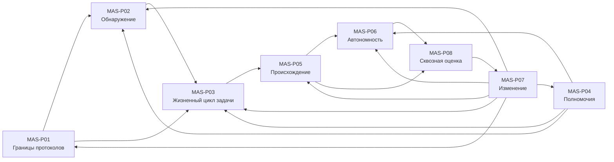

# Рамка принципов проектирования мультиагентных систем

**Редакция:** `0.1.0`  
**Дата:** 2026-07-27  
**Область:** гетерогенные программные мультиагентные системы, включая системы
с LLM  
**Первичный читатель:** архитектор или ведущий инженер  
**Основание:** [реестр стандартов и источников](MULTI-AGENT-SYSTEMS-SOURCE-PACK.md)

## Статус и границы применения

Эта редакция пригодна для пилотного архитектурного применения: выбора границ,
контрактов, проверок и эксплуатационных обязанностей. Она не является
сертификатом соответствия, гарантией безопасности, юридическим заключением или
заменой отраслевых требований.

Нормативная техническая база этой редакции закрепляет A2A `1.0.0` для
взаимодействия независимо управляемых агентов и MCP `2025-11-25` для доступа
агента или модели к инструментам, ресурсам и контексту. Развивающиеся
спецификации перечислены в реестре, но не создают обязательных требований.

В проверочных списках:

- **ОБЯЗАТЕЛЬНО** означает требование для заявления о применении паттерна;
- **РЕКОМЕНДУЕТСЯ** означает нормальный выбор, от которого можно отступить с
  зафиксированным обоснованием;
- **ДОПУСТИМО** означает разрешенный вариант, а не предпочтение.

## Как пользоваться

Начните с ситуации, которая ближе всего к вашей:

| Ситуация | Первый паттерн | Результат первого прохода |
|---|---|---|
| Нужно связать агентов, инструменты и внутренние сервисы | `MAS-P01` | Карта протокольных границ |
| Агент выбирает другого агента по объявленным возможностям | `MAS-P02` | Проверяемая запись обнаружения и допуска |
| Задача живет дольше одного запроса или может быть отменена | `MAS-P03` | Контракт жизненного цикла задачи |
| Агент действует от имени человека или организации | `MAS-P04` | Цепочка делегирования и предел полномочий |
| Результат нужно расследовать или воспроизвести | `MAS-P05` | Сквозная доказательная нить |
| Агент может создать существенный ущерб | `MAS-P06` | Профиль автономности и контрольные барьеры |
| Меняются версии протоколов, моделей или политик | `MAS-P07` | План совместимости и локального обновления |
| Компоненты проходят тесты, но система ведет себя нестабильно | `MAS-P08` | Сквозная программа оценки |

Для нового решения обычный маршрут: `MAS-P01 → MAS-P02 → MAS-P03`, затем
`MAS-P04` и `MAS-P06`; `MAS-P05`, `MAS-P07` и `MAS-P08` действуют поперек всей
архитектуры.

---

## MAS-P01 — Разделяйте протоколы по границе ответственности

### 1. Рамка проблемы

Используйте этот паттерн, когда в одной схеме присутствуют независимые агенты,
инструменты, данные и внутренние вызовы оркестратора. Если различие пропустить,
один протокол начинает нести несовместимые модели доверия, авторизации и
жизненного цикла.

Не используйте паттерн для выбора конкретной библиотеки внутри одного процесса,
если внешней границы и отдельной ответственности нет. Первый полезный шаг —
нарисовать каждое пересечение границы доверия и подписать, кто управляет обеими
сторонами.

### 2. Проблема

Универсальный «agent API» выглядит проще, но скрывает разницу между
делегированием задачи независимому агенту, вызовом инструмента и локальным
внутрипроцессным вызовом. Ошибка проявляется как чрезмерные полномочия,
невозможность отмены, неясная ответственность и хрупкая совместимость.

### 3. Силы

- единообразие интерфейсов против точности модели доверия;
- скорость первой интеграции против долгосрочной совместимости;
- прозрачный wire contract против свободы внутренней реализации;
- потоковая работа против повторов, отмены и восстановления.

### 4. Решение

1. Классифицируйте каждую связь:
   - независимо управляемый агент ↔ агент;
   - агент/модель ↔ инструмент, ресурс или контекст;
   - внутренний вызов внутри одного доверенного контура;
   - доменное событие между системами.
2. Для первой связи применяйте A2A `1.0.0`; для второй — MCP `2025-11-25`.
   Внутренние вызовы оставляйте локальными, а для общей оболочки событий
   используйте CloudEvents там, где это дает межсистемную совместимость.
3. Для каждой границы отдельно задайте идентичность, авторизацию,
   идемпотентность, таймаут, отмену, версионирование и наблюдаемость.
4. Не переносите credential или полномочие через границу автоматически.
5. Зафиксируйте атомарные утверждения границы:
   - `L-P01-01`: A2A сообщает задачу, сообщения и артефакты между агентами;
   - `L-P01-02`: MCP предоставляет инструменты, ресурсы и контекст;
   - `A-P01-01`: объявленная возможность не равна разрешению на действие;
   - `D-P01-01`: внутренняя реализация не является частью внешнего контракта;
   - `E-P01-01`: CloudEvent не заменяет доменную семантику задачи.

### 5. Практическое основание

В службе поддержки координатор передает возврат внешнему агенту через A2A, а
тот обращается к базе заказов через MCP. Локальный planning loop не публикуется
наружу. Если все три связи оформить одним RPC с одним токеном, компрометация
агента возвратов откроет инструмент сверх выданной задачи.

### 6. Проверенные точки зрения и смещения

Паттерн проверен с точки зрения управления, архитектуры, смысла данных,
практического применения и обучения команды. Он намеренно предпочитает явные
границы и может увеличить число контрактов; это компенсируется общими
профилями безопасности и тестовыми шаблонами.

### 7. Проверочный список

- ОБЯЗАТЕЛЬНО: каждая внешняя связь имеет владельца, модель доверия и отдельный
  контракт.
- ОБЯЗАТЕЛЬНО: A2A и MCP не объявлены взаимозаменяемыми.
- ОБЯЗАТЕЛЬНО: credential не пересылается через границу без нового ограниченного
  делегирования.
- РЕКОМЕНДУЕТСЯ: версия протокола и поддерживаемые возможности доступны до
  выполнения задачи.
- РЕКОМЕНДУЕТСЯ: события имеют стабильные `source`, `type`, `id` и связь с
  доменной задачей.

### 8. Типовые ошибки

- **Один протокол для всего.** Исправление: сначала разделить отношения
  ответственности, затем выбрать протокол.
- **MCP как межагентная шина.** Исправление: использовать MCP для tools/resources,
  а делегирование независимому агенту оформить A2A-контрактом.
- **A2A как локальный tool API.** Исправление: не публиковать внешнюю
  семантику задачи там, где нужен ограниченный вызов инструмента.

### 9. Последствия

Границы становятся проверяемыми, а отказ или компрометация локализуются. Цена —
несколько профилей интеграции и необходимость корреляции между ними.

### 10. Обоснование

Разные отношения требуют разных обещаний: задача может жить долго и
производить артефакты, инструментальный вызов обычно ограничен конкретной
операцией, а внутренний вызов не должен создавать внешний контракт.

### 11. Связь с актуальной практикой

- **Принято:** A2A `1.0.0` задает современную модель agent-to-agent
  (`SRC-A2A-100`).
- **Принято:** MCP `2025-11-25` задает agent/model-to-tool boundary
  (`SRC-MCP-20251125`).
- **Адаптировано:** CloudEvents `1.0.2` используется как нейтральная оболочка
  событий, но не как task protocol (`SRC-CLOUDEVENTS-102`).
- **Отклонено:** идея одного универсального agent protocol, потому что она
  смешивает роли A2A и MCP.

### 12. Отношения

Предшествует `MAS-P02` и `MAS-P03`; ограничивается `MAS-P04`; наблюдается через
`MAS-P05`; изменяется по правилам `MAS-P07`.

### 13. Маркер

`MAS-P01@0.1.0`

---

## MAS-P02 — Проверяйте возможность до делегирования

### 1. Рамка проблемы

Используйте этот паттерн, когда агент выбирает другого агента по Agent Card,
реестру, каталогу или сообщенному skill. Если принять объявление на веру,
маршрутизация превращается в удаленное выполнение непроверенного обещания.

Не используйте паттерн для статически связанного компонента внутри одного
контролируемого развертывания. Первый полезный результат — запись, которая
связывает обнаруженную возможность с проверенной идентичностью, версией,
политикой допуска и сроком актуальности.

### 2. Проблема

Capability discovery отвечает «что заявлено», но не отвечает «кому принадлежит
объявление», «разрешено ли делегирование» и «подтверждено ли поведение».

### 3. Силы

- динамическое обнаружение против supply-chain риска;
- богатое описание навыка против стабильности контракта;
- кеширование против отзыва и устаревания;
- совместимость против ложного доверия к версии.

### 4. Решение

1. Получите Agent Card или эквивалент только из разрешенного источника.
2. Проверьте происхождение, подпись или защищенный канал, идентичность владельца,
   поддерживаемые версии, auth scheme и назначение endpoint.
3. Сопоставьте требуемую задачу с заявленным skill и локальной политикой допуска.
4. Выполните безопасную capability probe или contract test, если риск выше
   низкого.
5. Кешируйте результат вместе со сроком, source URL, ключом/сертификатом,
   версией и причиной допуска; поддерживайте отзыв.
6. Отделяйте «совместим», «разрешен» и «доказал приемлемое качество».

### 5. Практическое основание

Координатор находит агента перевода. Карточка подписана, endpoint принадлежит
ожидаемой организации, A2A-версия совместима, а политика разрешает передачу
только обезличенного текста. Пробная задача подтверждает формат артефакта.
Карточка без подписи или с новым доменом отправляется на повторную проверку.

### 6. Проверенные точки зрения и смещения

Учтены управление реестром, архитектура, истинность заявлений, стоимость
проверки и понятность для эксплуатации. Паттерн склоняется к недоверию к
динамическим объявлениям; низкорисковые внутренние каталоги могут использовать
облегченный профиль.

### 7. Проверочный список

- ОБЯЗАТЕЛЬНО: возможность связана с проверяемой идентичностью и источником.
- ОБЯЗАТЕЛЬНО: допуск проверяет версию, auth scheme, endpoint и policy scope.
- ОБЯЗАТЕЛЬНО: кеш имеет срок и путь отзыва.
- РЕКОМЕНДУЕТСЯ: высокорисковая возможность проходит probe/contract test.
- ОБЯЗАТЕЛЬНО: discovery не считается ни авторизацией, ни оценкой качества.

### 8. Типовые ошибки

- **Карточка как разрешение.** Исправление: отдельное policy decision.
- **Кеш навсегда.** Исправление: TTL, отзыв и refresh по смене ключа/версии.
- **Выбор только по красивому описанию.** Исправление: машинно проверяемый
  контракт и тестовый пример.

### 9. Последствия

Динамическая композиция становится управляемой. Возникают задержка проверки,
операционная нагрузка на реестр и необходимость управлять ключами.

### 10. Обоснование

Обнаружение — утверждение о возможности, а делегирование — решение о доверии и
полномочии. Их разнесение блокирует подмену агента и устаревшие объявления.

### 11. Связь с актуальной практикой

- **Принято:** Agent Card и skill discovery A2A (`SRC-A2A-100`).
- **Адаптировано:** OASF используется как полезная emerging-линия описания
  возможностей, но не как нормативная замена A2A (`SRC-OASF`).
- **Принято:** NIST SSDF-подход к проверке компонентов и цепочки поставки
  распространяется на agent registry и карточки (`SRC-NIST-SSDF-A`).
- **Отклонено:** доверие к self-asserted capability без identity и policy check.

### 12. Отношения

Следует после `MAS-P01`; использует полномочия `MAS-P04`; создает вход для
`MAS-P03`; обновляется через `MAS-P07`.

### 13. Маркер

`MAS-P02@0.1.0`

---

## MAS-P03 — Делайте задачу явным долгоживущим контрактом

### 1. Рамка проблемы

Используйте этот паттерн, когда работа может продолжаться дольше одного
запроса, отдавать промежуточные сообщения, создавать артефакты, ждать человека,
повторяться или отменяться. Если моделировать ее как обычный RPC, повторы и
сбои создают дубли, потерянные результаты и неопределенную ответственность.

Не используйте паттерн для чистой локальной функции без внешних эффектов.
Первый полезный результат — таблица состояний задачи и допустимых переходов.

### 2. Проблема

В распределенной среде ответ может потеряться после успешного действия,
streaming может оборваться, callback может повториться, а агент может ждать
одобрения. Без явного task contract невозможно понять, что уже произошло.

### 3. Силы

- быстрый request/response против долгого жизненного цикла;
- повторяемость доставки против необратимых эффектов;
- автономность исполнителя против права инициатора на отмену;
- прогресс против утечки чувствительной промежуточной информации.

### 4. Решение

1. Присвойте задаче стабильный `task_id`, корреляционный идентификатор и
   идемпотентный ключ для каждого внешнего эффекта.
2. Объявите состояния как минимум: `submitted`, `working`, `input-required`,
   `completed`, `failed`, `canceled`; добавляйте состояния только с определенной
   семантикой перехода.
3. Разделите сообщения о ходе и результирующие артефакты.
4. Определите timeout, heartbeat, retry, cancel, resume, compensation и правила
   обработки позднего результата.
5. Для человеческого ввода укажите, кто может ответить, что именно
   раскрывается и когда ожидание прекращается.
6. Применяйте семантику FIPA request/propose/contract-net/subscribe там, где она
   делает намерение диалога яснее, но переносите ее в современный A2A-контракт.

### 5. Практическое основание

Агент закупок запрашивает три предложения. Каждый подзапрос имеет свой
идемпотентный ключ; потоковые сообщения показывают прогресс, а предложения
сохраняются как артефакты. После дедлайна позднее предложение регистрируется,
но не меняет решение без нового одобрения.

### 6. Проверенные точки зрения и смещения

Проверены управление обязанностями, распределенная архитектура, различие
сообщения и результата, эксплуатационная стоимость и обучаемость. Паттерн
предпочитает явную машину состояний; для коротких безопасных запросов допустим
сокращенный профиль.

### 7. Проверочный список

- ОБЯЗАТЕЛЬНО: состояния и переходы определены и тестируются.
- ОБЯЗАТЕЛЬНО: повтор доставки не повторяет необратимый эффект без проверки.
- ОБЯЗАТЕЛЬНО: отмена, timeout и поздний результат имеют определенное поведение.
- ОБЯЗАТЕЛЬНО: message и artifact не смешиваются.
- РЕКОМЕНДУЕТСЯ: human-in-the-loop имеет адресата, срок и минимальный контекст.

### 8. Типовые ошибки

- **RPC-маска для долгой работы.** Исправление: task resource и состояние.
- **Retry равен повторному действию.** Исправление: idempotency и effect ledger.
- **Completed без доказательства результата.** Исправление: связанный artifact,
  provenance и критерий приемки.

### 9. Последствия

Восстановление и расследование становятся предсказуемыми. Цена — хранение
состояния, очистка старых задач и более сложные тесты.

### 10. Обоснование

Задача — не транспортное сообщение, а координационный объект с историей,
полномочиями и результатом. Это различие удерживает повторы и частичные сбои в
контролируемых границах.

### 11. Связь с актуальной практикой

- **Принято:** A2A task/message/artifact lifecycle и streaming/push
  (`SRC-A2A-100`).
- **Адаптировано:** FIPA interaction protocols используются как семантические
  схемы намерений (`SRC-FIPA`).
- **Адаптировано:** MCP tasks учитываются только в пределах стабильной
  спецификации и объявленных возможностей (`SRC-MCP-20251125`).
- **Принято:** CloudEvents может переносить уведомление о переходе, но не
  определяет сам переход (`SRC-CLOUDEVENTS-102`).

### 12. Отношения

Строится на `MAS-P01` и `MAS-P02`; ограничивается `MAS-P04` и `MAS-P06`;
порождает доказательства для `MAS-P05`; тестируется в `MAS-P08`.

### 13. Маркер

`MAS-P03@0.1.0`

---

## MAS-P04 — Разделяйте идентичность, делегирование и полномочие

### 1. Рамка проблемы

Используйте этот паттерн, когда агент действует от имени человека,
организации, другого агента или workload. Если оставить только один общий
service token, аудит не различит инициатора, исполнителя и разрешенный предел
действия.

Не используйте паттерн как замену общему IAM-проектированию. Первый полезный
результат — цепочка «кто инициировал → кто делегировал → кто исполнил → на
каком ресурсе → в каком пределе».

### 2. Проблема

Аутентифицированный агент не обязательно уполномочен выполнить конкретное
действие. Передача исходного user token расширяет зону компрометации, а общий
секрет разрушает attribution и отзыв.

### 3. Силы

- бесшовная композиция против минимальных полномочий;
- автономность против согласия и ответственности;
- длинные задачи против короткоживущих credentials;
- трассируемость против приватности и минимизации данных.

### 4. Решение

1. Различайте human identity, agent identity, workload identity и
   organization/tenant.
2. На каждой границе выпускайте новый audience-bound и scope-bound grant,
   вместо сквозной передачи исходного токена.
3. Связывайте grant с задачей, сроком, ресурсом, разрешенными действиями,
   делегирующей стороной и путем отзыва.
4. Для межагентного уровня используйте объявленные A2A auth schemes; для MCP —
   соответствующий OAuth/OIDC-профиль или mTLS там, где это оправдано.
5. Разделяйте разрешение вызвать endpoint, право выполнить доменное действие и
   одобрение высокорискового эффекта.
6. Проверяйте tenant isolation и запрещайте confused deputy: исполнитель
   повторно проверяет audience, subject, scope и ресурс.

### 5. Практическое основание

Ассистент сотрудника может запросить черновик платежа, но не провести платеж.
Финансовый агент получает grant только на создание черновика для одной задачи.
Проведение требует отдельного одобрения уполномоченного человека; audit record
сохраняет обе идентичности и обе стадии.

### 6. Проверенные точки зрения и смещения

Проверены governance, IAM-архитектура, корректность attribution, стоимость
credential exchange и объяснимость. Паттерн предпочитает частые обмены токенов;
производительность компенсируется кешированием только в пределах срока и scope.

### 7. Проверочный список

- ОБЯЗАТЕЛЬНО: инициатор, делегирующая сторона и исполнитель различимы.
- ОБЯЗАТЕЛЬНО: grant ограничен audience, scope, ресурсом, задачей и временем.
- ОБЯЗАТЕЛЬНО: исходный credential не передается дальше как универсальный.
- ОБЯЗАТЕЛЬНО: высокорисковый эффект имеет отдельное policy decision/approval.
- РЕКОМЕНДУЕТСЯ: отзыв проверяется до необратимого действия.

### 8. Типовые ошибки

- **Один service account для всех агентов.** Исправление: workload identity и
  task-bound delegation.
- **Аутентифицирован — значит разрешен.** Исправление: отдельная авторизация
  доменного действия.
- **Token passthrough.** Исправление: token exchange или новый ограниченный
  grant на каждой границе.

### 9. Последствия

Снижается blast radius и восстанавливается ответственность. Цена — более
сложный IAM, управление ключами и необходимость согласовать отзыв с долгими
задачами.

### 10. Обоснование

Идентичность отвечает «кто», делегирование — «от чьего имени и в каком
пределе», авторизация — «можно ли это действие сейчас». Смешение этих вопросов
создает privilege escalation.

### 11. Связь с актуальной практикой

- **Принято:** A2A auth declaration, signed Agent Cards и защищенные bindings
  (`SRC-A2A-100`).
- **Принято и адаптировано:** MCP authorization для tool/resource boundary
  (`SRC-MCP-20251125`).
- **Принято:** least privilege и secure development из NIST SP 800-218A
  (`SRC-NIST-SSDF-A`).
- **Адаптировано:** ISO/IEC 42001 и 38507 связывают технические полномочия с
  организационной ответственностью (`SRC-ISO-42001`, `SRC-ISO-38507`).

### 12. Отношения

Ограничивает `MAS-P02`, `MAS-P03` и `MAS-P06`; оставляет доказательства в
`MAS-P05`; проверяется сквозными сценариями `MAS-P08`.

### 13. Маркер

`MAS-P04@0.1.0`

---

## MAS-P05 — Стройте сквозную нить происхождения и наблюдаемости

### 1. Рамка проблемы

Используйте этот паттерн, когда результат должен быть объяснен, воспроизведен,
оспорен или расследован через несколько агентов и инструментов. Если хранить
только финальный текст или разрозненные логи, нельзя восстановить, какие данные,
модели, политики и действия создали результат.

Не используйте паттерн как обещание истинности: полная трасса может точно
показывать путь к ошибочному ответу. Первый полезный результат — единый
correlation graph от внешнего запроса до задачи, tool calls, approvals и
артефактов.

### 2. Проблема

В распределенной системе локальные логи имеют разные идентификаторы и сроки,
часть решений происходит в модели, а часть — в политике, человеке или внешнем
сервисе. Без общей нити расследование превращается в догадки.

### 3. Силы

- воспроизводимость против стоимости хранения;
- детализация против утечки prompts, PII и секретов;
- единая схема против неоднородных платформ;
- неизменяемость аудита против права на удаление и retention policy.

### 4. Решение

1. Введите сквозные идентификаторы: interaction, task, parent task, agent,
   tool call, artifact, policy decision и approval.
2. Записывайте версии протокола, модели, prompt/policy bundle, инструмента,
   данных и evaluator, необходимые для воспроизведения.
3. Представляйте происхождение как связи «что использовано», «что создано»,
   «кто/что действовал» и «кому приписано», совместимые с W3C PROV-O.
4. Коррелируйте A2A и MCP telemetry в общем trace; используйте OpenTelemetry
   соглашения только в проверенном объеме.
5. Разделяйте:
   - operational telemetry;
   - audit evidence;
   - privacy/security logs;
   - evaluation evidence.
6. Редактируйте или хешируйте чувствительный контент, но сохраняйте
   доказательство версии и связи.
7. Для каждого утверждения определите retention, доступ, целостность и
   процедуру расследования.

### 5. Практическое основание

Ответ клиенту создан координатором, агентом поиска и агентом политики. Trace
показывает A2A task tree, MCP-вызовы, версии базы знаний и модели, policy
decision и итоговый artifact. Секреты и полный prompt не сохраняются; вместо
них остаются защищенная ссылка, хеш версии и контролируемый источник.

### 6. Проверенные точки зрения и смещения

Проверены управление доказательствами, observability architecture, смысл
происхождения, эксплуатационная стоимость и понятность расследования. Паттерн
склоняется к записываемости; privacy threat model ограничивает содержимое и
срок хранения.

### 7. Проверочный список

- ОБЯЗАТЕЛЬНО: внешний запрос связан с задачами, tool calls и результатом.
- ОБЯЗАТЕЛЬНО: версии модели, политики и инструмента восстановимы для
  критических решений.
- ОБЯЗАТЕЛЬНО: provenance не заявляется доказательством правильности.
- ОБЯЗАТЕЛЬНО: секреты и чувствительные данные имеют правила редактирования,
  доступа и retention.
- РЕКОМЕНДУЕТСЯ: инцидент можно воспроизвести без административного доступа ко
  всем исходным системам.

### 8. Типовые ошибки

- **Логируем всё.** Исправление: data classification, redaction и минимальный
  доказательный набор.
- **Trace равен аудиту.** Исправление: отдельно определить целостность, retention
  и контроль доступа к audit evidence.
- **Согласие агентов как доказательство.** Исправление: независимая проверка
  утверждения и качества.

### 9. Последствия

Расследование и оценивание становятся воспроизводимыми. Цена — хранилище,
correlation engineering, privacy review и управление схемами.

### 10. Обоснование

Происхождение связывает результат с действиями и источниками, а наблюдаемость
показывает эксплуатационное поведение. Их совместное, но не смешанное
использование дает доказательства без ложного обещания корректности.

### 11. Связь с актуальной практикой

- **Принято:** W3C PROV-O для семантики происхождения (`SRC-PROVO`).
- **Адаптировано:** OpenTelemetry GenAI conventions для telemetry, пока их
  стабильность подтверждена локальным профилем (`SRC-OTEL-GENAI`).
- **Принято:** NIST AI RMF требует измеримости и управляемой информации о риске
  (`SRC-NIST-AIRMF`, `SRC-NIST-GENAI`).
- **Адаптировано:** CloudEvents дает переносимые event identifiers, но не
  заменяет provenance graph (`SRC-CLOUDEVENTS-102`).

### 12. Отношения

Получает события от `MAS-P02`–`MAS-P04`; дает доказательства `MAS-P06`,
`MAS-P07` и `MAS-P08`.

### 13. Маркер

`MAS-P05@0.1.0`

---

## MAS-P06 — Ограничивайте автономность риском и обратимостью

### 1. Рамка проблемы

Используйте этот паттерн, когда агент способен воздействовать на деньги,
доступ, репутацию, права человека, производство, безопасность или другие
значимые ценности. Если автономность задать одним флагом, одинаковый путь
получат чтение документа и необратимое физическое действие.

Не используйте паттерн для утверждения, что human approval автоматически
делает действие безопасным. Первый полезный результат — профиль действия с
влиянием, обратимостью, полномочием, бюджетом и необходимым уровнем контроля.

### 2. Проблема

LLM-агент может ошибиться, быть обманут входом, зациклиться, превысить расходы
или сложить несколько разрешенных шагов в запрещенный эффект. Компонентные
ограничения не гарантируют системный предел.

### 3. Силы

- скорость и масштаб автономности против тяжести последствий;
- локальные разрешения против накопительного эффекта;
- человек в контуре против automation bias и усталости;
- fail-safe остановка против доступности услуги.

### 4. Решение

1. Для каждого класса действия оцените:
   - потенциальное влияние и затронутые стороны;
   - обратимость и время для отмены;
   - неопределенность и обнаружимость ошибки;
   - полномочие и чувствительность данных;
   - каскадный и накопительный эффект.
2. Назначьте режим:
   - наблюдение/совет;
   - ограниченное обратимое действие;
   - действие после policy gate;
   - действие после независимого человеческого одобрения;
   - запрещенное автономное действие.
3. Закрепите бюджеты времени, стоимости, числа шагов, внешних эффектов и
   делегирований; определите их исчерпание.
4. Введите allowlist инструментов, sandbox, separation of duties, rate limit,
   circuit breaker и stop authority.
5. При неопределенном статусе высокорискового действия останавливайтесь
   безопасно и передавайте решение уполномоченной стороне.
6. Для киберфизического действия добавьте независимый инженерный interlock и
   отраслевой safety analysis; сообщение агента не является командой привода.

### 5. Практическое основание

Агент диагностики может читать телеметрию и предлагать план. Он может
автоматически открыть низкорисковую заявку, но остановка оборудования требует
проверки правила, подтверждения оператора и PLC/interlock. После исчерпания
лимита попыток агент прекращает делегирование и сообщает причину.

### 6. Проверенные точки зрения и смещения

Проверены governance, control architecture, неопределенность, полезность и
понимание оператором. Паттерн предпочитает контролируемость; профиль риска может
разрешать большую автономность для дешевых, обратимых и хорошо наблюдаемых
действий.

### 7. Проверочный список

- ОБЯЗАТЕЛЬНО: автономность назначена по классу действия, а не по агенту целиком.
- ОБЯЗАТЕЛЬНО: необратимые/высокорисковые эффекты имеют независимый gate.
- ОБЯЗАТЕЛЬНО: бюджеты и поведение при исчерпании заданы и тестируются.
- ОБЯЗАТЕЛЬНО: есть stop, revoke и incident path.
- ОБЯЗАТЕЛЬНО: human approval показывает факты, последствия и альтернативу, а
  не только кнопку «разрешить».

### 8. Типовые ошибки

- **Autonomous=true.** Исправление: профиль по действиям и последствиям.
- **Человек как декоративный gate.** Исправление: время, компетенция,
  объяснение и реальное право отказа.
- **Каждый шаг разрешен — значит цепочка разрешена.** Исправление: cumulative
  effect budget и policy на план целиком.

### 9. Последствия

Blast radius становится ограниченным и измеримым. Цена — задержка, инженерия
барьеров и необходимость поддерживать классификацию действий.

### 10. Обоснование

Риск создается не наличием LLM, а сочетанием неопределенности, полномочий,
последствий и возможности восстановления. Поэтому автономность — ограниченный
режим действия, а не свойство агента.

### 11. Связь с актуальной практикой

- **Принято:** ISO/IEC 23894 и 42005 для risk/impact assessment
  (`SRC-ISO-23894`, `SRC-ISO-42005`).
- **Принято:** NIST AI RMF и GenAI Profile для Govern/Map/Measure/Manage и
  LLM-рисков (`SRC-NIST-AIRMF`, `SRC-NIST-GENAI`).
- **Адаптировано:** IEEE 2660.1 применяется в промышленном профиле, но не
  заменяет safety interlock (`SRC-IEEE-2660-1`).
- **Принято:** организационная ответственность ISO/IEC 42001 и 38507
  (`SRC-ISO-42001`, `SRC-ISO-38507`).

### 12. Отношения

Опирается на полномочия `MAS-P04` и доказательства `MAS-P05`; ограничивает
жизненный цикл `MAS-P03`; проверяется `MAS-P08`; меняется по `MAS-P07`.

### 13. Маркер

`MAS-P06@0.1.0`

---

## MAS-P07 — Управляйте совместимостью как изменяемым контрактом

### 1. Рамка проблемы

Используйте этот паттерн, когда меняются протоколы, Agent Cards, модели,
инструменты, политики, схемы событий или тестовые наборы. Если полагаться на
«latest», вчера совместимые агенты могут молча изменить смысл задачи или
полномочий.

Не используйте паттерн для косметического изменения, которое не влияет на
контракт, поведение или доказательства. Первый полезный результат — матрица
поддерживаемых версий и локальная область влияния изменения.

### 2. Проблема

Мультиагентная система зависит от независимо обновляемых компонентов. Даже
обратно совместимый wire format может изменить поведение модели, инструмента,
policy engine или evaluator.

### 3. Силы

- быстрые обновления против воспроизводимости;
- обратная совместимость против удаления опасного поведения;
- локальный refresh против скрытых транзитивных зависимостей;
- feature negotiation против комбинаторного числа вариантов.

### 4. Решение

1. Закрепляйте версии A2A, MCP, схем, моделей, prompt/policy bundles,
   инструментов и evaluator в развертывании и audit evidence.
2. Публикуйте диапазоны совместимости и согласовывайте capability/version до
   задачи; неизвестную обязательную возможность отклоняйте.
3. Поддерживайте contract tests для Agent Card, auth, task lifecycle,
   messages/artifacts, MCP capabilities и ошибок.
4. Для каждого изменения вычисляйте минимальную зависимую область:
   контракт, политики, тесты, документация, telemetry и сохраненные задачи.
5. Выполняйте canary/shadow replay на репрезентативных сценариях; для
   несовместимого изменения выпускайте migration и deprecation notice.
6. Не повышайте experimental/RC-источник до baseline без отдельного решения.
7. Храните возможность локального отката, кроме случаев, когда старая версия
   небезопасна; тогда используйте контролируемое прекращение.

### 5. Практическое основание

После финального выпуска новой редакции MCP команда сравнивает изменения со
стабильной `2025-11-25`, обновляет только agent-tool boundary, запускает
contract tests и shadow evaluation. A2A-взаимодействие не перестраивается, если
зависимость не затронута.

### 6. Проверенные точки зрения и смещения

Проверены governance версий, dependency architecture, смысл совместимости,
стоимость тестов и понятность migration. Паттерн склоняется к pinning; security
patch может потребовать ускоренного обновления с компенсирующими проверками.

### 7. Проверочный список

- ОБЯЗАТЕЛЬНО: production не зависит от неопределенного `latest`.
- ОБЯЗАТЕЛЬНО: version/capability negotiation имеет отрицательный путь.
- ОБЯЗАТЕЛЬНО: contract tests покрывают успех, ошибку, отмену, retry и auth.
- ОБЯЗАТЕЛЬНО: RC, PAR и experimental sources не считаются stable baseline.
- РЕКОМЕНДУЕТСЯ: refresh локален, а глобальный пересмотр имеет доказанную
  dependency closure.

### 8. Типовые ошибки

- **Semver как доказательство совместимости.** Исправление: behavior contract
  tests и replay.
- **Обновить всё.** Исправление: минимальная зависимая область и локальный
  refresh.
- **Не обновлять никогда.** Исправление: freshness triggers, deprecation и
  security response.

### 9. Последствия

Изменения становятся управляемыми и воспроизводимыми. Цена — version inventory,
test matrix, поддержка migration и временное сосуществование версий.

### 10. Обоснование

Совместимость — утверждение о конкретных возможностях и поведении в заданном
окне, а не свойство номера версии. Локальный пересмотр снижает стоимость, не
скрывая транзитивный риск.

### 11. Связь с актуальной практикой

- **Принято:** version negotiation A2A и capability negotiation MCP
  (`SRC-A2A-100`, `SRC-MCP-20251125`).
- **Отклонено для baseline:** MCP `2026-07-28` RC до финального выпуска и
  migration review (`SRC-MCP-RC-20260728`).
- **Адаптировано:** NIST SP 800-218A для secure change и dependency management
  (`SRC-NIST-SSDF-A`).
- **Адаптировано:** ISO/IEC 42001 continual improvement, но без требования
  глобального обновления (`SRC-ISO-42001`).

### 12. Отношения

Пересматривает любой из `MAS-P01`–`MAS-P06` и `MAS-P08`; использует
доказательства `MAS-P05`.

### 13. Маркер

`MAS-P07@0.1.0`

---

## MAS-P08 — Оценивайте систему, а не только отдельных агентов

### 1. Рамка проблемы

Используйте этот паттерн, когда каждый агент или модель проходит локальные
тесты, но остаются ошибки делегирования, зацикливание, потеря контекста,
каскадный отказ или непредсказуемая стоимость. Если оценивать только ответы
компонентов, сквозное поведение остается невидимым.

Не используйте паттерн как один универсальный score. Первый полезный результат —
набор сквозных сценариев с ожидаемым результатом, недопустимым эффектом,
границей остановки и доказательствами.

### 2. Проблема

Качество мультиагентной системы возникает из взаимодействий: маршрутизации,
делегирования, состояния, полномочий, инструментов и человеческих решений.
Улучшение одного показателя может ухудшить безопасность, стоимость или
устойчивость.

### 3. Силы

- повторяемые тесты против стохастичности моделей;
- компонентная диагностика против системной реалистичности;
- широкое покрытие против стоимости прогонов;
- агрегированный отчет против скрытых критических провалов.

### 4. Решение

1. Оцените отдельно и совместно:
   - правильность выбора агента и инструмента;
   - сохранение цели и ограничений при handoff;
   - task lifecycle, retry, cancel и восстановление;
   - соблюдение полномочий и автономных бюджетов;
   - factual/task quality и качество артефакта;
   - latency, cost, step count и resource use;
   - устойчивость к prompt injection, spoofing, malicious agent и tool failure;
   - участие человека и качество escalation.
2. Включите положительные, граничные, враждебные и recovery-сценарии.
3. Сохраняйте версии всей конфигурации и provenance каждого прогона.
4. Используйте несколько независимых показателей и hard gates; не скрывайте
   критический провал средним баллом.
5. Выполняйте replay после изменения агента, модели, инструмента, политики или
   протокола; production telemetry используется как сигнал новых тестов.
6. Проверяйте emergent failures: цикл делегирования, amplification ошибки,
   collusion/sycophancy, resource exhaustion и распределение ответственности.

### 5. Практическое основание

Три агента правильно решают свои локальные задачи, но координатор дважды
делегирует возврат и создает две заявки. Сквозной сценарий с потерянным ответом
обнаруживает дефект идемпотентности, который не виден в model benchmark.
Исправление проверяется повторным прогоном с теми же версиями и fault injection.

### 6. Проверенные точки зрения и смещения

Проверены governance оценки, test architecture, допустимость выводов,
практическая стоимость и объяснимость. Паттерн склоняется к широкому
сценарному покрытию; риск-ориентированный отбор удерживает стоимость.

### 7. Проверочный список

- ОБЯЗАТЕЛЬНО: есть end-to-end сценарии, а не только model/unit tests.
- ОБЯЗАТЕЛЬНО: критический security/safety провал не компенсируется средним
  quality score.
- ОБЯЗАТЕЛЬНО: тест фиксирует версии и доказательства прогона.
- ОБЯЗАТЕЛЬНО: проверяются handoff, retry, cancel, tool failure и malicious input.
- РЕКОМЕНДУЕТСЯ: production incidents и near misses превращаются в regression
  tests.

### 8. Типовые ошибки

- **Лучше модель — лучше система.** Исправление: сквозные сценарии и системные
  показатели.
- **Средний score скрывает катастрофу.** Исправление: hard gates и
  неагрегированные критические результаты.
- **Evaluator знает ответ из тех же данных.** Исправление: независимые наборы,
  provenance и проверка leakage.

### 9. Последствия

Командные и каскадные дефекты становятся видимыми до эксплуатации. Цена —
дорогой harness, управление тестовыми данными и вариативность результатов.

### 10. Обоснование

Мультиагентное поведение — свойство сети взаимодействий. Поэтому оценка должна
пересекать те же границы, что задача, полномочия и доказательства.

### 11. Связь с актуальной практикой

- **Принято:** NIST AI RMF и GenAI Profile для risk-based measurement и
  управления (`SRC-NIST-AIRMF`, `SRC-NIST-GENAI`).
- **Адаптировано:** ISO/IEC 42005 связывает сценарии с воздействием и
  затронутыми сторонами (`SRC-ISO-42005`).
- **Принято:** NIST SP 800-218A для security testing жизненного цикла
  (`SRC-NIST-SSDF-A`).
- **Отслеживается, но не принято как норма:** IEEE P3777/P7022 и другие PAR
  могут изменить будущие профили agent evaluation (`SRC-IEEE-PARS`).

### 12. Отношения

Проверяет применение `MAS-P01`–`MAS-P07`; получает доказательства от `MAS-P05`;
создает триггеры изменения для `MAS-P07`.

### 13. Маркер

`MAS-P08@0.1.0`

---

## Сквозные приемочные случаи

### Случай A — Поддержка клиента с внешним агентом возвратов

**Ситуация.** Координатор вызывает независимо управляемого агента возвратов,
который использует внутренний инструмент заказов.

**Применение.**

- A2A обслуживает межагентную задачу, MCP — доступ к заказам (`MAS-P01`);
- Agent Card проверяется до делегирования (`MAS-P02`);
- задача имеет idempotency, cancel и artifact результата (`MAS-P03`);
- grant разрешает создать черновик, но не провести выплату (`MAS-P04`);
- trace связывает клиента, задачи, tool calls, approval и результат (`MAS-P05`);
- крупный возврат требует независимого одобрения (`MAS-P06`);
- обновление протокола проходит contract replay (`MAS-P07`);
- сценарий с потерянным ответом проверяет отсутствие двойной выплаты
  (`MAS-P08`).

**Приемка.** Повтор сообщения не создает вторую выплату; оператор может
восстановить цепочку; внешний агент не получает полномочий сверх одной задачи.

### Случай B — Промышленная диагностика

**Ситуация.** Несколько агентов анализируют вибрацию и предлагают действие для
оборудования.

**Применение.** Рекомендации и артефакты передаются между агентами; физическое
действие проходит отдельный IAM/policy/safety interlock. Происхождение связывает
телеметрию, модель и решение, а fault injection проверяет потерю связи,
конфликт агентов и ошибочную рекомендацию.

**Приемка.** Ни одно текстовое сообщение агента не управляет приводом напрямую;
при неопределенности система сохраняет безопасное состояние и вызывает
уполномоченного оператора.

### Случай C — Исследовательский ансамбль LLM

**Ситуация.** Агенты создают гипотезы, ищут источники и критикуют ответы.

**Применение.** Инструменты поиска подключаются через ограниченные grants,
источники и версии моделей сохраняются, а независимый evaluator проверяет
финальный артефакт. Бюджет ограничивает число итераций и взаимных делегирований.

**Приемка.** Согласие агентов не заменяет проверку; источник каждого
существенного утверждения восстанавливается; исчерпание бюджета завершает цикл
с явным неполным статусом.

## Сводная карта отношений

## Карта источников и пересмотра

| Паттерн | Основные источники | Пересмотреть при |
|---|---|---|
| `MAS-P01` | A2A, MCP, CloudEvents | новая стабильная версия A2A/MCP |
| `MAS-P02` | A2A, OASF watchlist, NIST SSDF | изменение Agent Card/signing/discovery |
| `MAS-P03` | A2A, FIPA, MCP | изменение task lifecycle или delivery semantics |
| `MAS-P04` | A2A, MCP, NIST SSDF, ISO governance | изменение auth/delegation или IAM threat model |
| `MAS-P05` | PROV-O, OpenTelemetry, NIST | изменение telemetry/provenance/privacy требований |
| `MAS-P06` | ISO 42001/42005/23894/38507, NIST, IEEE 2660.1 | новый impact/risk профиль или существенный инцидент |
| `MAS-P07` | A2A, MCP, NIST SSDF, ISO 42001 | любая несовместимая редакция или security advisory |
| `MAS-P08` | NIST, ISO 42005, IEEE watchlist | новый стандарт оценки или обнаруженный emergent failure |

Минимальный пересмотр затрагивает строку источника, связанные утверждения,
паттерны и regression cases. Глобальная новая редакция нужна только при
изменении границ области или нескольких базовых контрактов.

## Зависимости и редакции

- Основной реестр: `MULTI-AGENT-SYSTEMS-SOURCE-PACK.md@0.1.0`.
- Предыдущая редакция отсутствует.
- Совместимость будущих редакций не предполагается без migration note.
- История решений и ограничения текущей редакции вынесены из пользовательского
  документа в сопровождающие материалы.

`MULTI-AGENT-SYSTEMS-PRINCIPLES-FRAMEWORK@0.1.0`
